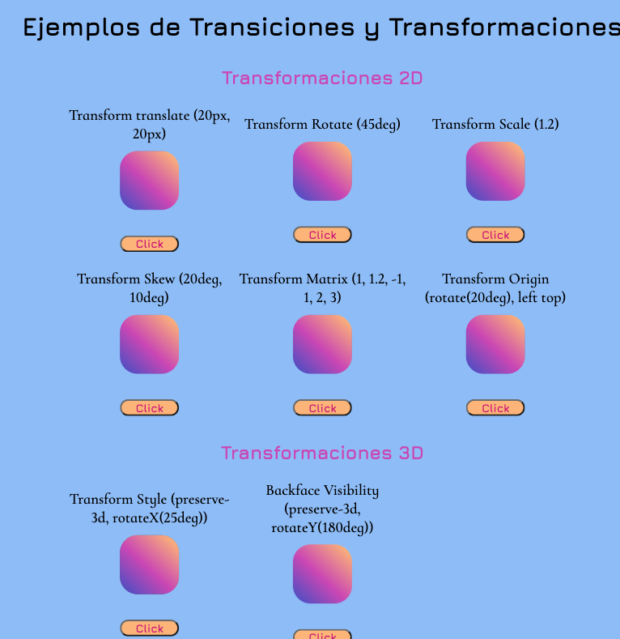

# transiciones-transformaciones

Mi objetivo con este proyecto es explicar de manera sencilla los dintintos ejemplos de transformaciones y transiciones que se pueden hacer en CSS.

También he realizado un Parallax ,que solo se ve en la versión desktop, donde se pueden observar algunos de los efectos 3D que se pueden conseguir solo con CSS.

Espero que os sirva de guía.

## Autor

Cristina Muñiz.
